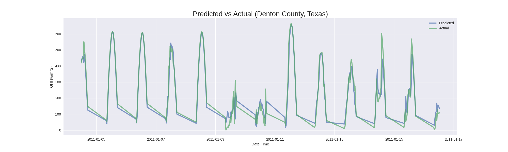
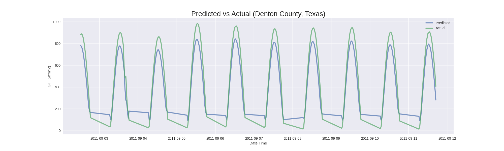

# Irradiance-RNN
Irradiance-RNN is a partially configurable Recurrent Neural Network (RNN) implementing Long-short term memory (LSTM) layers designed to forecast irradiance data.
* My source of solar irradiance data comes from the [National Solar Radiation Database (NSRDB)](https://nsrdb.nrel.gov/) provided for free by the [National Renewable Energy Laboratory (NREL)](https://nrel.gov/). Check out the [NSRDB docs](https://nsrdb.nrel.gov/about/u-s-data.html) for a more detailed explanation.
* The inspiration behind this project comes from  *Alzahrani et al.* who provided an initial RNN structure for me to get started [1].
* I have modified *Alzahrani et al.* approach by adding dropout layers with a dropout rate of p=0.3 in order to prevent overfitting issues.
* The code, in its current state, uses a years worth of data to train the model (might change this later).
* May also make this more user friendly in the future.

## Results
* The demonstrated model was trained with a years worth of 30 minute interval data from 2010 (Denton County, Texas).
* The model was evaluated with 300 sequential data points (mostly for visual purposes) from various time frames in 2011 (Denton County, Texas).

<p align="center">RMSE ~0.07 for some days in January 2011</p>



<p align="center">RMSE ~0.19 for some days in September 2011<p align="center">



## Documentation

### Setup
* Create a virtual environment with Python 3.6 installed and run the following commands <br>
* NOTE: You need a cuda enabled device on your machine (sorry)
```
git clone https://github.com/antoninodimaggio/Irradiance-RNN.git
cd Irradiance-RNN
pip install -r requirements.txt
```

### Part 1: Downloading Data
* First you need to get an api key from [NREL](https://developer.nrel.gov/signup/) (it's easy and free)
* Add your api key and other information to the config.example.json located in Irradiance-RNN/src/process/config.example.json (remove example from the path)
```
cd src/process
```
* Open grab_data.py (preferably the whole project) in a text editor and change the variables to download the data that you want
* These variables are denoted by <i> THINGS YOU CAN EDIT </i> you can not miss it
* Repeat this process to get your training and testing data
```
python grab_data.py
```

### Part 2: Training and Testing
* Navigate to Irradiance-RNN/src/nn
* Change the variables in the run.py file to the desired values (default values are already set)
* These variables are denoted by <i> THINGS YOU CAN EDIT </i> you can not miss it
* There are comments in run.py that explain what each variable means
```
python run.py
```

### Part 3: Look At Your Results
* Go to the images folder to find your plots of predicted vs. actual irradiance!

## Attributions/Thanks
* This project would not be possible without the GPU access provided to me by Rutgers University's Department of Computer Science.

## References
1.  A. Alzahrani, P. Shamsi, C. Dagli, and M. Ferdowsi, “Solar Irradiance Forecasting 		Using Deep Neural Networks,” ​Procedia Computer Science​, vol. 114, pp. 304–313, 2017, doi:​ ​10.1016/j.procs.2017.09.045​.
