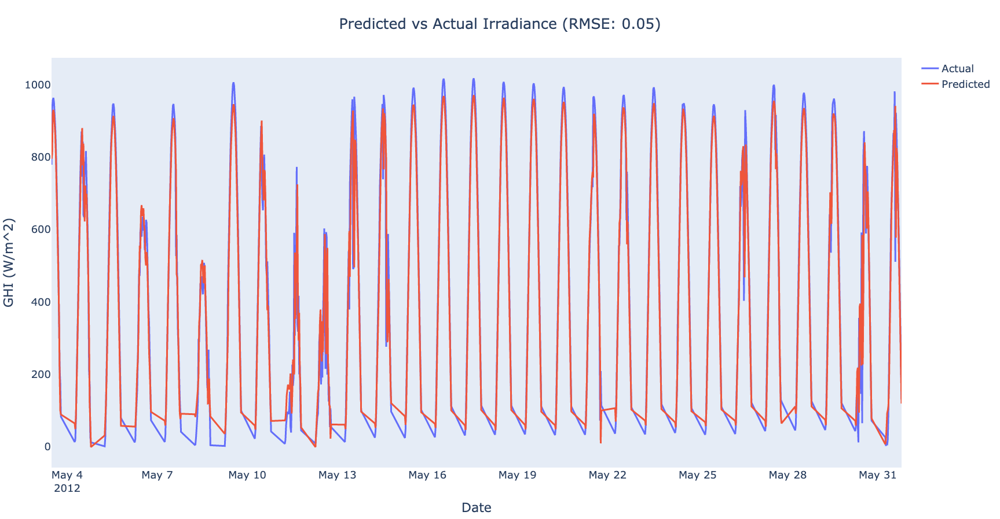

# Irradiance-RNN
Irradiance-RNN is a partially configurable Recurrent Neural Network (RNN) implementing Long-Short Term Memory (LSTM) layers designed to forecast solar irradiance.
<p>
  <a href="https://github.com/antoninodimaggio/Irradiance-RNN/blob/master/LICENSE">
      
  </a>
  <a href="https://www.python.org/">
       
   </a>
</p>

## Introduction
The RNN is implemented using [PyTorch](https://pytorch.org/). The solar irradiance data comes from the [National Solar Radiation Database (NSRDB)](https://nsrdb.nrel.gov/).
### Data Preprocessing
* Removal of entries with zero irradiance (early morning and night hours)
* Normalization between 1 and -1 (LSTM layers use hyperbolic tangent)

## Results
<div align="center">
  
</div>

## Setup
**Required**
* Python 3.6 +
* Get an API key from [NREL](https://developer.nrel.gov/signup/)
* Add your API access details to `/Irradiance-RNN/config/config.example.json`
* Remove `.example` from `/Irradiance-RNN/config/config.example.json`
```
git clone https://github.com/antoninodimaggio/Irradiance-RNN.git
cd Irradiance-RNN
pip install -r requirements.txt
```
## Download Training and Testing Data
* **Make sure that there is no space when using comma separated values**
* Detailed information on each argument can be found [here](docs/DOCS.md)
* You could also use `python download.py -h` for help
```
python download.py --lat 33.2164 \
      --lon -97.1292 \
      --train-years 2010,2011 \
      --test-years 2012,2013 \
      --interval 30
```
## Training
* It is advised to change the `--model-name` after each run, otherwise a model with the same name will be overwritten.
* Detailed information on each argument can be found [here](docs/DOCS.md)
* You could also use `python train.py -h` for help
```
python train.py --lat 33.2164 \
      --lon -97.1292 \
      --train-years 2010,2011 \
      --seq-length 64 \
      --batch-size 64 \
      --model-name model \
      --start-date 2010-01-01 \
      --end-date 2011-06-01 \
      --hidden-size 35 \
      --num-layers 2 \
      --dropout 0.3 \
      --epochs 5 \
      --lr 1e-2 \
      --decay 1e-5 \
      --step-size 2 \
      --gamma 0.5
```
## Evaluation and Plotting
* Make sure that the arguments `--seq-length`, `--model--name`, `hidden-size`, and `--num-layers` are the same as what was used to train your model
* Detailed information on each argument can be found [here](docs/DOCS.md)
* You could also use `python evaluate.py -h` for help
```
python evaluate.py --lat 33.2164 \
      --lon -97.1292 \
      --test-years 2012 \
      --seq-length 64 \
      --model-name model \
      --start-date 2012-05-01 \
      --end-date 2012-06-01 \
      --hidden-size 35 \
      --num-layers 2 \
      --plot
```
## Attributions/Thanks
* This project would not be possible without the GPU access provided to me by Rutgers University's Department of Computer Science.
* The inspiration behind this project comes from  [*Alzahrani et al.*](https://www.sciencedirect.com/science/article/pii/S1877050917318392) who provided an initial RNN structure for me to get started.
