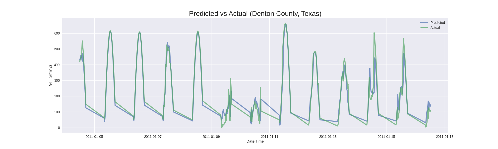
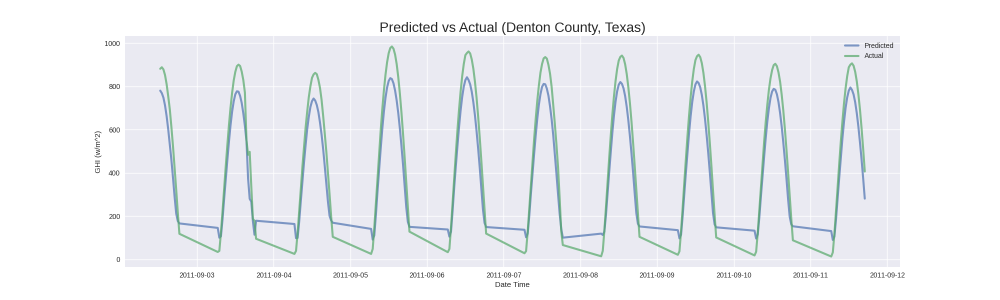

# Irradiance-RNN
Irradiance-RNN is a partially configurable Recurrent Neural Network (RNN) implementing Long-Short Term Memory (LSTM) layers designed to forecast solar irradiance.
<p>
  <a href="https://github.com/antoninodimaggio/Irradiance-RNN/blob/master/LICENSE">
      
  </a>
  <a href="https://www.python.org/">
       
   </a>
</p>

## Introduction
The RNN is implemented using [PyTorch](https://pytorch.org/). The solar irradiance data comes from the [National Solar Radiation Database (NSRDB)](https://nsrdb.nrel.gov/).The code, in its current state, uses a year's worth of data to train the model.

## Results
* The data used to train and evaluate the model is from Denton County, Texas.
* The model was trained with a year's worth of 30 minute interval data from 2010.
* The model was evaluated with 300 sequential data points (mostly for visual purposes) from various time frames in 2011.

<p align="center">RMSE: 0.07 for some days in January 2011</p>



<p align="center">RMSE: 0.19 for some days in September 2011</p>



## Setup
**Required**
* Python 3.6 +
* CUDA 10.2 ([Instructions](https://pytorch.org/get-started/locally/) for installing PyTorch on 9.2 or 10.1)
* Get an API key from [NREL](https://developer.nrel.gov/signup/)
* Add your API access details to `/Irradiance-RNN/config/config.example.json`
* Remove `.example` from `/Irradiance-RNN/config/config.example.json`
```
git clone https://github.com/antoninodimaggio/Irradiance-RNN.git
cd Irradiance-RNN
pip install -r requirements.txt
```
## Download Training and Testing Data
* Download at least two years worth of irradiance data -- one year for training, one year for testing. This means you have to run `python download.py` at least twice.
* Detailed information on each argument can be found [here](docs/DOCS.md)
* You could also use `python download.py -h` for help
```
python download.py --lat 33.2164 \
      --lon -97.1292 \
      --year 2010 \
      --leap-year false \
      --interval 30
```
## Training
* Everything from `--batch-size` through `--gamma` is set to the corresponding default values. They are specified for demonstration purposes in this case.
* It is advised to change the `--name` after each run, otherwise a model with the same name will be overwritten.
* Detailed information on each argument can be found [here](docs/DOCS.md)
* You could also use `python train.py -h` for help
```
python train.py --train-data-path ./data/csv/33.2164_-97.1292_2010.csv \
      --test-data-path ./data/csv/33.2164_-97.1292_2011.csv \
      --name model \
      --batch-size 64 \
      --seq-length 64 \
      --hidden-size 35 \
      --num-layers 2 \
      --dropout 0.3 \
      --epochs 8 \
      --lr 1e-2 \
      --decay 1e-5 \
      --step-size 2 \
      --gamma 0.5
```
## Evaluation and Plotting
* Make sure that the arguments `--seq-length` through `--num-layers` are the same as what was used to train your model
* It is advised to change the `--plot-name` after each run, otherwise a plot with the same name will be overwritten.
* Detailed information on each argument can be found [here](docs/DOCS.md)
* You could also use `python eval.py -h` for help
```
python eval.py --test-data-path ./data/csv/33.2164_-97.1292_2011.csv \
      --name model \
      --seq-length 64 \
      --hidden-size 35 \
      --num-layers 2 \
      --plot \
      --s-split 0 \
      --e-split 800 \
      --plot-name test
```
## Attributions/Thanks
* This project would not be possible without the GPU access provided to me by Rutgers University's Department of Computer Science.
* The inspiration behind this project comes from  [*Alzahrani et al.*](https://www.sciencedirect.com/science/article/pii/S1877050917318392) who provided an initial RNN structure for me to get started.
